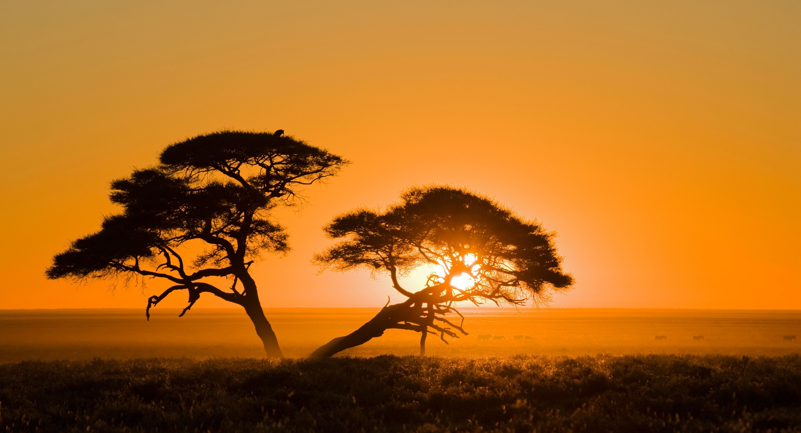
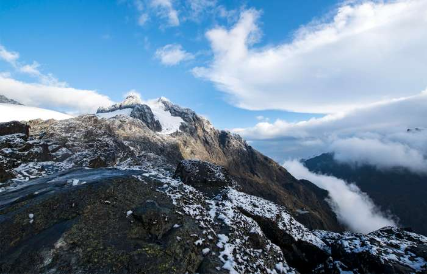

# Africa

Africa, the second largest continent (after Asia), covering about one-fifth of the total land surface of Earth. The continent is bounded on the west by the Atlantic Ocean, on the north by the Mediterranean Sea, on the east by the Red Sea and the Indian Ocean, and on the south by the mingling waters of the Atlantic and Indian oceans.

The continent is cut almost equally in two by the Equator, so that most of Africa lies within the tropical region, bounded on the north by the Tropic of Cancer and on the south by the Tropic of Capricorn. Because of the bulge formed by western Africa, the greater part of Africa’s territory lies north of the Equator. Africa is crossed from north to south by the prime meridian (0° longitude), which passes a short distance to the east of Accra, Ghana.

The whole of Africa can be considered as a vast plateau rising steeply from narrow coastal strips and consisting of ancient crystalline rocks. The plateau’s surface is higher in the southeast and tilts downward toward the northeast. In general the plateau may be divided into a southeastern portion and a northwestern portion. The northwestern part, which includes the Sahara (desert) and that part of North Africa known as the Maghrib, has two mountainous regions—the Atlas Mountains in northwestern Africa, which are believed to be part of a system that extends into southern Europe, and the Ahaggar (Hoggar) Mountains in the Sahara. The southeastern part of the plateau includes the Ethiopian Plateau, the East African Plateau, and—in eastern South Africa, where the plateau edge falls downward in a scarp—the Drakensberg range. One of the most remarkable features in the geologic structure of Africa is the East African Rift System, which lies between 30° and 40° E. The rift itself begins northeast of the continent’s limits and extends southward from the Ethiopian Red Sea coast to the Zambezi River basin.

### General considerations

The African continent essentially consists of five ancient Precambrian cratons—Kaapvaal, Zimbabwe, Tanzania, Congo, and West African—that were formed between about 3.6 and 2 billion years ago and that basically have been tectonically stable since that time; those cratons are bounded by younger fold belts formed between 2 billion and 300 million years ago. All of those rocks have been extensively folded and metamorphosed (that is, they have been modified in composition and structure by heat and pressure). Precambrian rock outcrops appear on some 57 percent of the continent’s surface, while the rest of the surface consists of largely undeformed younger sediments and volcanic rocks.

